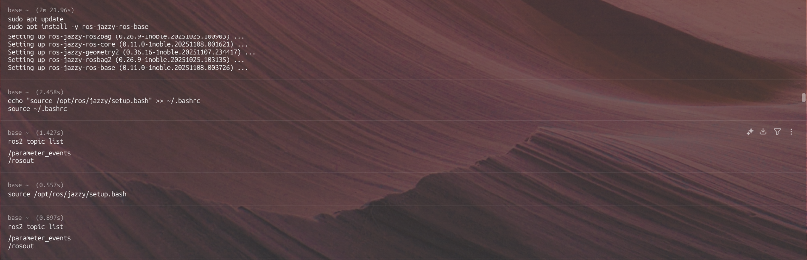

# Isaac Sim Installation & Setup Guide

## Installing NVIDIA Isaac Sim (Linux x86_64)

### 1. Download Isaac Sim
Download the Isaac Sim Linux build from NVIDIA's official documentation:
```
https://docs.isaacsim.omniverse.nvidia.com/5.1.0/installation/quick-install.html
```

**Google search:** 
---
**tar file for linux:** 
---

### 2. Create Installation Directory(optional)
```bash
mkdir ~/isaac-sim
```

---

### 3. Extract the Archive
Move the downloaded archive into the installation folder and extract:
```bash
cd ~/isaac-sim
unzip isaac-sim-standalone-5.1.0-linux-x86_64.zip
```

**After extracted:** 

---

### 4. Run Post-Install Setup
```bash
cd isaac-sim-standalone-5.1.0-linux-x86_64
./post_install.sh
```

*This configures cache folders and prepares the runtime environment.*

**Running post_install.sh:** 

---

### 5. Launch Application Selector
```bash
./isaac-sim.selector.sh
```

Select **Start**. First startup may show a blank window for several minutes while shaders compile.

---

### 6. Headless Mode (Optional - for ROS Pipelines)
For running ROS pipelines without GUI:
```bash
chmod +x ~/isaac-sim/isaac-sim-standalone-5.1.0-linux-x86_64/isaac-sim.sh
./isaac-sim.sh --no-window --headless --/renderer/modes/enable=0
```

*This launches Isaac Sim in headless mode with minimal GPU load, suitable for ROS bridge operations.*

**Minimal-headless mode:** 

---

## Verification

To verify successful installation:
1. Isaac Sim UI should launch without errors
2. Check logs for any CUDA/GPU warnings
3. Verify ROS bridge functionality (covered in next section)

**GUI:** 
---
**sample_scene:** 
---
**Action_graph:** 


---

# Isaac ROS Installation

## ROS 2 Jazzy Setup
```bash
sudo apt update
sudo apt install -y software-properties-common
sudo add-apt-repository universe

sudo curl -s -o /usr/share/keyrings/ros-archive-keyring.gpg \
  https://raw.githubusercontent.com/ros/rosdistro/master/ros.key

echo "deb [arch=amd64 signed-by=/usr/share/keyrings/ros-archive-keyring.gpg] \
  http://packages.ros.org/ros2/ubuntu noble main" | \
  sudo tee /etc/apt/sources.list.d/ros2.list > /dev/null

#THIS IS WHAT I DID (MINIMAL DUE TO SPACE CONSTRAINTS)
sudo apt update 
sudo apt install -y ros-jazzy-ros-base

#FOR FULL SETUP
sudo apt update
sudo apt install -y ros-jazzy-desktop ros-jazzy-vision-msgs
```

**Repo added:** 
---
**ROS-base:** 

## Isaac ROS Packages
```bash
sudo apt-get install -y \
  ros-jazzy-isaac-ros-yolov8 \
  ros-jazzy-isaac-ros-dnn-image-encoder \
  ros-jazzy-isaac-ros-tensor-rt
```

**Known Issue:** TensorRT dependencies may fail on RTX 3050/student laptops. Root cause: `libnvinfer` library incompatibility. Workaround: Docker-based installation (see Troubleshooting).


---

# Python Dependencies

## YOLOv8 Processing Node

Since Isaac ROS YOLOv8 binary packages require TensorRT (unavailable on certain hardware), we use a lightweight Python-based alternative with Ultralytics YOLOv8.

### Install Required Packages
```bash
python3 -m pip install --upgrade pip
python3 -m pip install ultralytics opencv-python-headless numpy
```

### Package Breakdown
| Package | Purpose |
|---------|---------|
| `ultralytics` | YOLOv8 model and inference engine |
| `opencv-python-headless` | ROS2 image → NumPy array conversion (no GUI overhead) |
| `numpy` | Image array manipulation |

**Python dependencies:** 

