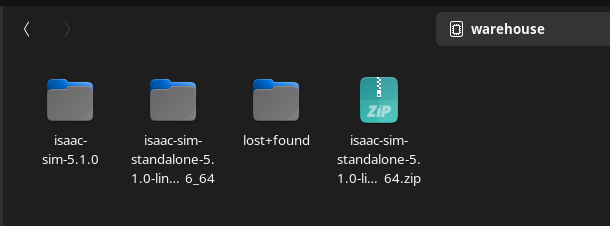
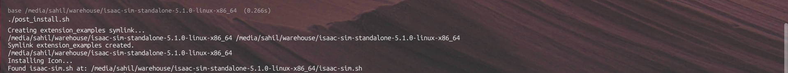

# Isaac Sim Installation & Setup Guide
```

witsense-isaac-yolov8/
├── pre-requisite.md
├── README.md
├── simple_scene.usd
├── src
│   ├── camera.py
│   ├── isaac_ros_yolov8.py
│   └── requirements.txt
├── ss-witsense
│   ├── action-graph.png
|    ...
│   └── isaac-sim
│       └── isaac-sim-ss.png
|        ...
├── YOLOv8 Detect.png
└── yolov8n.pt

```
# A) - Installing NVIDIA Isaac Sim 

### 1. Download Isaac Sim
Download the Isaac Sim Linux build from NVIDIA's official documentation [Documentation](https://docs.isaacsim.omniverse.nvidia.com/5.1.0/installation/quick-install.html):
```
https://docs.isaacsim.omniverse.nvidia.com/5.1.0/installation/quick-install.html
```

**Google search:** 
---
**tar file for linux(x86_64):** 
---

### 2. Create Installation Directory(optional)
```bash
mkdir ~/isaac-sim
```

---

### 3. Extract the Archive
Move the downloaded archive into the installation folder and extract:
```bash
cd ~/isaac-sim
unzip isaac-sim-standalone-5.1.0-linux-x86_64.zip
```

**After extracted:** 

---

### 4. Run Post-Install Setup
```bash
cd isaac-sim-standalone-5.1.0-linux-x86_64
./post_install.sh
```

*This configures cache folders and prepares the runtime environment.*

**Running post_install.sh:** 

---

### 5. Launch Application Selector
```bash
./isaac-sim.selector.sh
```

Select **Start**. First startup may show a blank window for several minutes while shaders compile.

---

### 6. Headless Mode (Optional - for ROS Pipelines)
For running ROS pipelines without GUI:
```bash
chmod +x ~/isaac-sim/isaac-sim-standalone-5.1.0-linux-x86_64/isaac-sim.sh
./isaac-sim.sh --no-window --headless --/renderer/modes/enable=0
```

*This launches Isaac Sim in headless mode with minimal GPU load, suitable for ROS bridge operations.*

**Minimal-headless mode:** 

---

## Verification

To verify successful installation:
1. Isaac Sim UI should launch without errors
2. Check logs for any CUDA/GPU warnings
3. Verify ROS bridge functionality
   
**GUI(MY LAPTOP):** 
---

# B) - Isaac ROS Installation [Documentation](https://nvidia-isaac-ros.github.io/getting_started/index.html#run-an-isaac-ros-demo)

### 1. Install the dependencies:
```bash
sudo apt update && sudo apt install curl gnupg
sudo apt install software-properties-common
sudo add-apt-repository universe
```
---
### 2. Source the Isaac ROS Apt Repository(US) 
```bash
k="/usr/share/keyrings/nvidia-isaac-ros.gpg"
curl -fsSL https://isaac.download.nvidia.com/isaac-ros/repos.key | sudo gpg --dearmor \
    | sudo tee -a $k > /dev/null
f="/etc/apt/sources.list.d/nvidia-isaac-ros.list"
sudo touch $f
s="deb [signed-by=$k] https://isaac.download.nvidia.com/isaac-ros/release-4.0 "
s="${s}noble main"
grep -qxF "$s" $f || echo "$s" | sudo tee -a $f

sudo apt-get update
```
---
## ROS 2 Jazzy Setup
### 3.  Add ROS2 Repository
```bash
sudo curl -s -o /usr/share/keyrings/ros-archive-keyring.gpg \
  https://raw.githubusercontent.com/ros/rosdistro/master/ros.key

echo "deb [arch=amd64 signed-by=/usr/share/keyrings/ros-archive-keyring.gpg] \
  http://packages.ros.org/ros2/ubuntu noble main" | \
  sudo tee /etc/apt/sources.list.d/ros2.list > /dev/null
```
---
### 4. Install ROS2 Jazzy 
### Option A: Minimal (What You Did - ~2GB)
```bash
#THIS IS WHAT I DID (MINIMAL DUE TO SPACE CONSTRAINTS)
sudo apt update 
sudo apt install -y ros-jazzy-ros-base
```
---
### Option B: Full Desktop (~4GB)
```bash
#FOR FULL SETUP
sudo apt update
sudo apt install -y ros-jazzy-desktop ros-jazzy-vision-msgs
```
---
**Repo added:** 
---


# Python Dependencies - GPU Solution


### 1. Install Required Packages

```bash
python3 -m pip install --upgrade pip
python3 -m pip install torch torchvision --index-url https://download.pytorch.org/whl/cu121
python3 -m pip install tensorrt pycuda opencv-python numpy
```

---

## Package Breakdown

| Package | Purpose |
|---------|---------|
| `torch`  | PyTorch with CUDA support for GPU-accelerated inference |
| `torchvision` | Computer vision models and utilities for PyTorch |
| `tensorrt` | NVIDIA's high-performance neural network inference optimizer |
| `pycuda` | Python interface to CUDA for GPU programming |
| `opencv-python` | Image processing and ROS2 image conversion |
| `numpy` | Numerical array operations for image manipulation |


---

### C) - How to use my Code

### Prerequisites
```bash
# Install dependencies
pip3 install ultralytics opencv-python cv-bridge
sudo apt install ros-jazzy-cv-bridge
```
**Python dependencies to work on CPU :** 

### Step 1: Launch Isaac Sim
```bash
cd ~/isaac-sim
./isaac-sim.sh
# Open simple_scene.usd
# Press Play
```

### Step 2: Run Detection Node
```bash
# Make sure ROS can see Isaac Sim topics
export ROS_DOMAIN_ID=0
source /opt/ros/jazzy/setup.bash
python3 camera.py
```

### Expected Output
```
[INFO] YOLOv8 Node Started - Subscribing to /sim/camera/rgb
```
****
****
****
OpenCV window shows live camera feed with potential detections.

