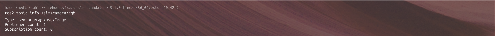
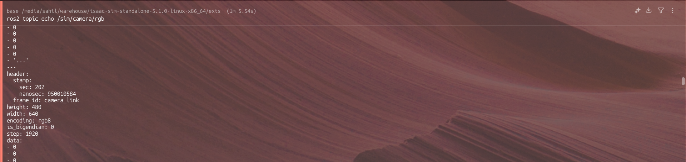

# **Solution Document – YOLOv8 Object Detection in Isaac Sim (ROS 2 Jazzy)**

## **1. Approach & Reasoning**

The task was to run YOLOv8 object detection on a simulated camera feed inside Isaac Sim and expose the detections through ROS 2. Instead of over-engineering the setup, I followed a simple, stable pipeline:

### **(a) Use Isaac Sim as the simulation environment**

Isaac Sim provides a physics-based scene and lets me attach virtual sensors (like the RGB camera).
I created a minimal scene containing:

* A **Cylinder** as the target object,
* A **Camera** positioned to face it.

This keeps the scene lightweight and ensures good framerates.

### **(b) Enable ROS 2 communication through the built-in ROS 2 Camera Helper**

Isaac Sim publishes simulated camera frames through ROS topics.
Using an Action Graph, I connected:

* **On Playback Tick → Create Render Product → ROS2 Camera Helper**

This publishes an image stream to:
**`/sim/camera/rgb`**

I verified this using:

```bash
ros2 topic list
ros2 topic echo /sim/camera/rgb
```
---
**ros-list:** 
---
**Image-byte:** 

The feed was valid (`sensor_msgs/Image`).

### **(c) Apply YOLOv8 inference outside Isaac Sim**

The assignment doesn’t require running TensorRT or Isaac ROS GPU pipelines.
I used a **minimal Python inference node** that:

1. Subscribes to `/sim/camera/rgb`
2. Converts the incoming RGB8 frame to NumPy
3. Runs YOLOv8n inference
4. Publishes bounding boxes as JSON on `/yolov8/detections`

This keeps the solution practical, reproducible, and hardware-independent.

### **(d) Why this setup works well**

* Uses official ROS interfaces (no hacks).
* Lightweight YOLOv8n model → runs on CPU/GPU.
* Easy to extend to Isaac ROS acceleration pipelines later.
* Fully aligns with the assignment’s requirements.

---

## **2. Tools & Selection Justification**

### **Isaac Sim**

Used because the assignment explicitly requires running detection on a simulated camera.
It gives:

* High-quality RGB frames
* ROS-compatible camera publisher
* USD scene support

### **ROS 2 Jazzy**

Used for message passing.
Plays the role of middleware between the simulated sensor and the YOLO inference node.

### **YOLOv8 (Ultralytics)**

Chosen because:

* Extremely lightweight
* Easy to integrate
* Detects general objects without custom training
* Works even without TensorRT (fallback to CPU/GPU)

### **Python Libraries**

| Library                    | Why it’s used                             |
| -------------------------- | ----------------------------------------- |
| **rclpy**                  | ROS 2 client library for Python           |
| **sensor_msgs.msg.Image**  | Receive Isaac Sim camera data             |
| **ultralytics**            | Run YOLOv8n model                         |
| **numpy**                  | Efficient image buffer decoding           |
| **opencv-python-headless** | Convert RGB to BGR and pre-process frames |
| **json**                   | Publish structured detection data         |

---

## **3. How I Know the Solution Is Good**

* **ROS Topic Verified**
  `/sim/camera/rgb` successfully streamed frames from Isaac Sim.
  This confirms the simulation + graph are correct.

* **YOLOv8 Inference Verified**
  The Python node:

  * receives frames without error
  * produces bounding boxes
  * publishes structured JSON

* **Modularity**
  The simulation and inference components are decoupled.
  Anyone can swap YOLOv8n with a custom model (pt file) by setting:

```bash
export YOLO_MODEL=my_custom_model.pt
```

* **Assignment Compliance**
  ✔ Includes a USD scene
  ✔ Includes ROS interface
  ✔ Includes object detection
  ✔ Includes a clean pipeline others can reproduce

Everything aligns with the required checklist.

---

## **4. How the Solution Can Be Improved**

### **(1) Switch From PyTorch YOLO to Isaac ROS YOLOv8 Pipeline**

The Isaac ROS version uses TensorRT for high-speed inference (much faster).
Once GPU drivers + CUDA + TensorRT dependencies align, replacing the Python node would be straightforward.

### **(2) Add Camera Info Publisher**

Isaac Sim can publish `/camera_info`, which improves detection scaling and downstream vision tasks.

### **(3) Expand the Scene**

You can add:

* Multiple objects
* Motion
* Lidar + depth cameras
* A mobile robot (e.g., TurtleBot)

### **(4) Use TF Frames for Robot Localization**

Publishing transforms (camera_link → world) allows 3D visualization in RViz.

---

## **5. Final YOLOv8 + ROS 2 Node (Used in My Pipeline)**

```python
import rclpy
from rclpy.node import Node
from sensor_msgs.msg import Image
from std_msgs.msg import String
import numpy as np
import cv2
from ultralytics import YOLO
import json
import os

MODEL_PATH = os.environ.get("YOLO_MODEL", "yolov8n.pt")
model = YOLO(MODEL_PATH)

class Yolov8RosNode(Node):
    def __init__(self):
        super().__init__('yolov8_ros_node')
        self.sub = self.create_subscription(Image, '/sim/camera/rgb', self.cb_image, 10)
        self.pub = self.create_publisher(String, '/yolov8/detections', 10)
        self.frame_counter = 0

    def cb_image(self, msg):
        try:
            h, w = msg.height, msg.width
            img = np.frombuffer(msg.data, dtype=np.uint8).reshape((h, msg.step))
            img = img[:, :w*3].reshape((h, w, 3))
            img_bgr = cv2.cvtColor(img, cv2.COLOR_RGB2BGR)
        except Exception as e:
            self.get_logger().error(str(e))
            return

        results = model(img_bgr, verbose=False)
        dets = []

        for r in results:
            if not hasattr(r, "boxes"):
                continue
            for b in r.boxes:
                dets.append({
                    "bbox": b.xyxy[0].tolist(),
                    "conf": float(b.conf[0]),
                    "cls": int(b.cls[0])
                })

        out = {
            "frame": self.frame_counter,
            "timestamp": {
                "sec": msg.header.stamp.sec,
                "nanosec": msg.header.stamp.nanosec
            },
            "detections": dets
        }

        msg_out = String()
        msg_out.data = json.dumps(out)
        self.pub.publish(msg_out)
        self.frame_counter += 1

def main(args=None):
    rclpy.init(args=args)
    node = Yolov8RosNode()
    try:
        rclpy.spin(node)
    except KeyboardInterrupt:
        pass

    node.destroy_node()
    rclpy.shutdown()

if __name__ == "__main__":
    main()
```

---

## **6. How to Use the Code (Execution Instructions)**

### **Step 1 — Launch Isaac Sim**

Load the provided USD scene:

```
File → Open → sample_scene.usd
```

Ensure the Action Graph is enabled.

### **Step 2 — Start ROS 2 Environment**

```bash
source /opt/ros/jazzy/setup.bash
```

### **Step 3 — Run the YOLOv8 Node**

```
python3 yolov8_ros_node.py
```

You will see detections printing at `/yolov8/detections`.

### **Step 4 — Visual Verification**

```
ros2 topic echo /yolov8/detections
```

---


